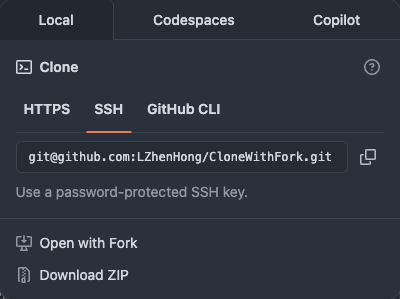

# Clone with Fork

A Chrome extension which clone GitHub repository with [Fork](https://fork.dev/) app.

## How To Use



## Build

```bash
# Build ts file.
tsc
```

## Development

```bash
# Install npm dependencies
npm install
```
